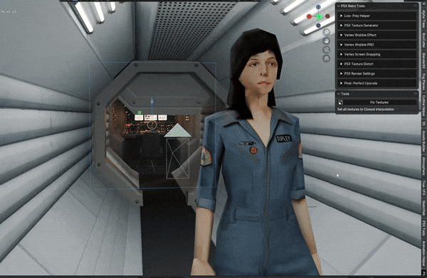
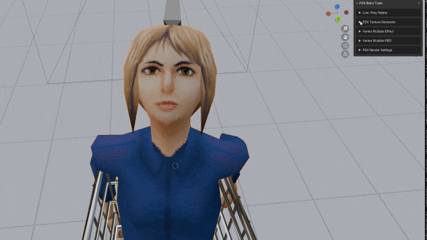
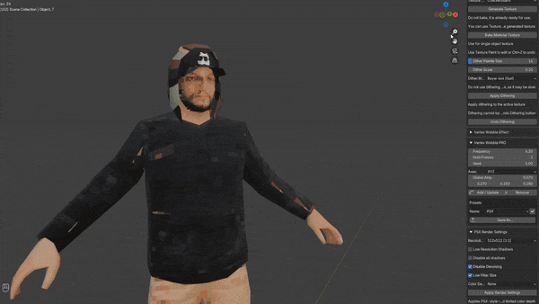
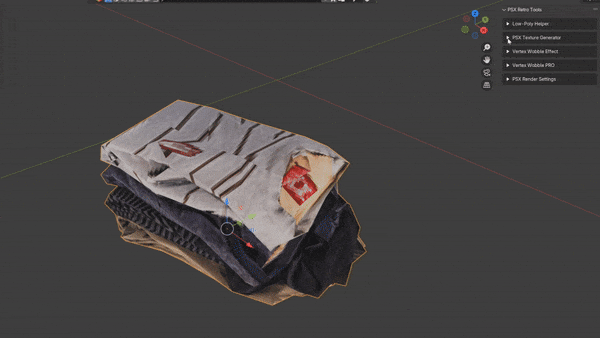
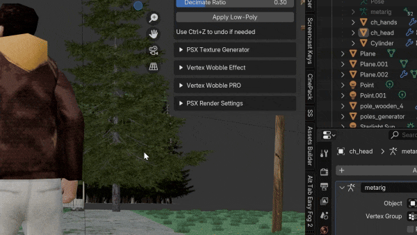
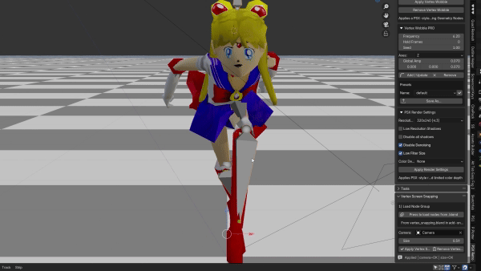
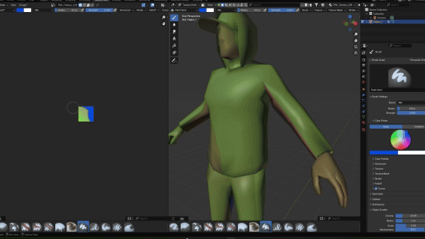
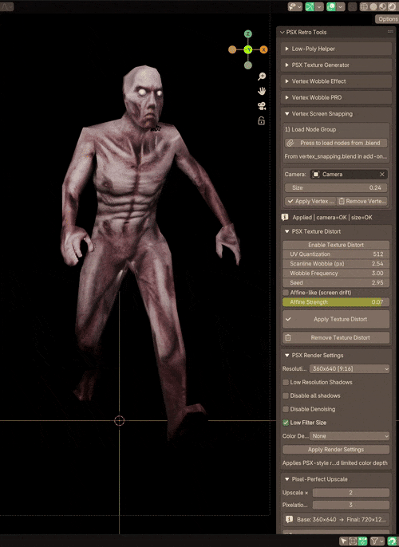
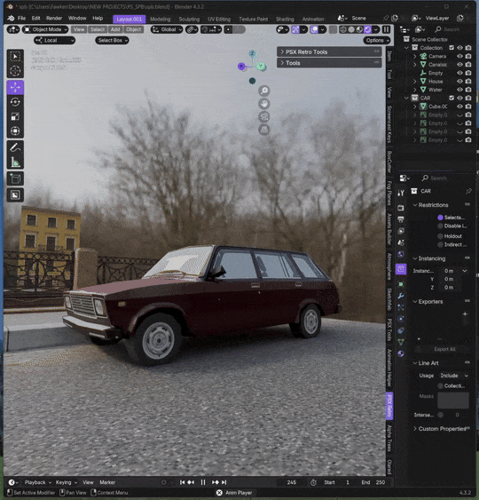

# PSX Retro Tools for Blender

Bring authentic PlayStation 1 style visuals into Blender with a focused toolkit for low-poly rendering, low-resolution textures, dithering, vertex wobble, screen snapping, and retro-friendly render setup.

**Downloaded by 8,000+ artists and developers**

[Get PSX Retro Tools on itch.io](https://fawkek.itch.io/psx-retro-tools)

## What It Does

PSX Retro Tools is built to make PS1-inspired workflows fast and practical inside Blender. Instead of assembling a retro look from scattered tricks and manual setup, you get a single toolkit designed for stylized low-res production.

It is aimed at 3D artists, game developers, technical artists, and retro enthusiasts who want recognizable PSX-era visuals without fighting their tools.

## Features

- Low-Poly Simplifier for fast PSX-style mesh reduction and triangulation
- Low-Resolution Texture Baking into a single texture atlas
- Texture Generator for checkerboards, gradients, and paint-ready bases
- Color Dithering with Bayer, Floyd-Steinberg, Atkinson, and more
- Vertex Wobble for classic PS1-style geometry jitter
- Vertex Wobble PRO with hold frames, axis control, per-axis amplitude, and presets
- Vertex Screen Snapping for true retro-style vertex movement
- Render Presets for quick PSX resolution, color depth, anti-aliasing, and shadow setup
- Pixel Perfect Upscale
- Texture Distort
- PSX PostFX material preview workflow

## Why Artists Use It

- Fast one-click setup for a retro rendering pipeline
- Built for game art, animation, experiments, and stylized indie projects
- Designed around practical production tasks, not just visual gimmicks
- Keeps the workflow inside Blender instead of splitting it across multiple tools

## Preview

### Low-Poly, Dithering, and Texture Workflow

### Vertex Wobble and Screen Snapping

### Render, Upscale, and Distortion Tools

## Current Version

Version `1.6.2`

Highlights from the current release:

- Added PSX PostFX for non-destructive node-based texture preview in materials
- Added Add/Update PostFX and Remove PostFX actions
- Added real-time PostFX controls for brightness, contrast, posterize, dither, gamma, and saturation
- Improved active-texture targeting and viewport refresh behavior
- Fixed a PostFX Apply crash in Blender node handling

## Compatibility

- Blender `4.3+`
- Tested on Windows and macOS
- Some features require `Pillow`
- Some workflows use `NumPy`

## Installation

The addon itself is distributed through itch.io:

[Download and install from itch.io](https://fawkek.itch.io/psx-retro-tools)

The itch.io page includes:

- the latest addon builds
- dependency installer
- installation steps
- version updates and devlogs

## Source Code

This repository is a public showcase page for PSX Retro Tools.

The addon source code is private and is not included in this repository.

No addon Python files, packaged releases, or proprietary implementation details are published here.

## License

All rights reserved.

This repository does not grant permission to copy, redistribute, repackage, reverse engineer, or reuse the commercial addon source code.

See [LICENSE.md](LICENSE.md) for details.

## Links

- itch.io: [PSX Retro Tools](https://fawkek.itch.io/psx-retro-tools)
- X / Twitter: [@fawkek_obj](https://x.com/fawkek_obj)

