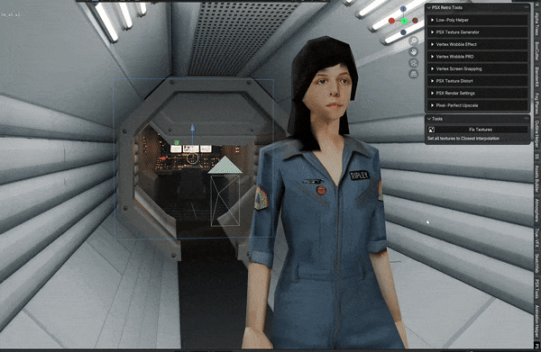
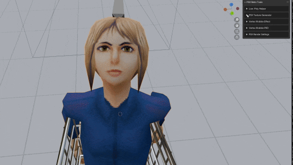
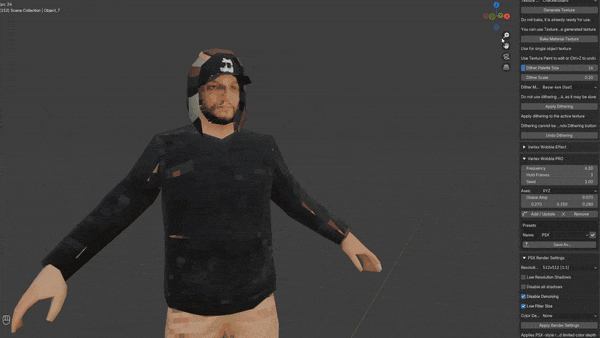
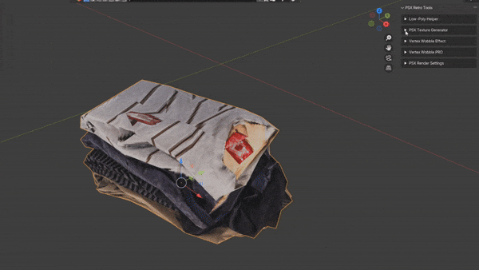
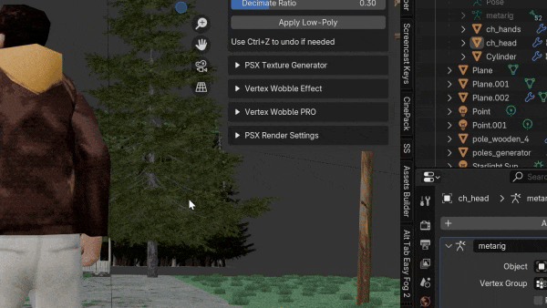
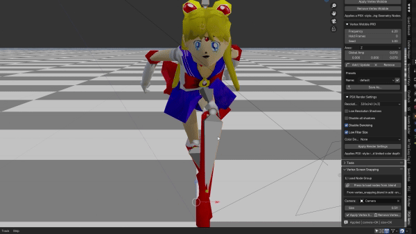
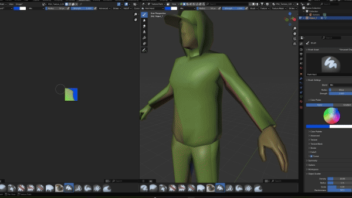
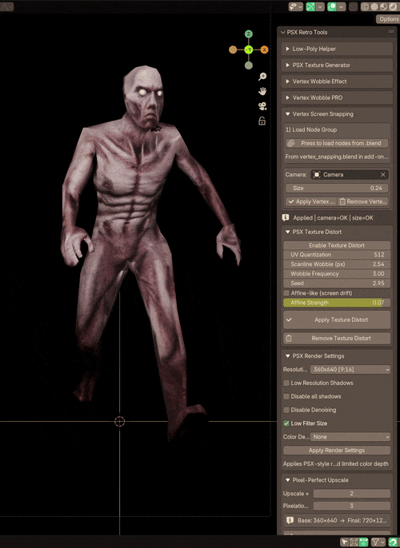
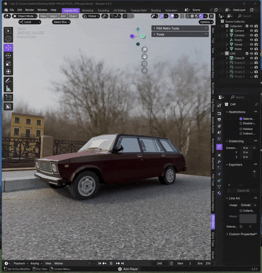

# PSX Retro Tools for Blender

Bring authentic PlayStation 1-style visuals into Blender with a focused toolkit for low-poly rendering, low-resolution textures, vertex lighting, billboards, dithering, wobble, screen snapping, and retro post-processing.

**Downloaded by 8,000+ artists and developers**

[Download on itch.io](https://fawkek.itch.io/psx-retro-tools) · [Read the devlogs](https://fawkek.itch.io/psx-retro-tools/devlog) · [Follow @fawkek_obj](https://x.com/fawkek_obj)

## What It Does

PSX Retro Tools is built to make PS1-inspired workflows fast and practical inside Blender. Instead of assembling a retro look from scattered tricks and manual setup, you get a single toolkit designed for stylized low-res production.

It is aimed at 3D artists, game developers, technical artists, and retro enthusiasts who want recognizable PSX-era visuals without fighting their tools.

## Features

- **Low-Poly Simplifier** for fast mesh reduction and triangulation
- **Low-Resolution Texture Baking** with per-material baking by default or targeted active-material rebaking
- **Texture Generator** with checkerboards, gradients, paint-ready bases, and a labeled UV Debug Grid
- **Color Dithering** with Bayer, Floyd–Steinberg, Atkinson, and other algorithms
- **PSX PostFX** with six non-destructive material presets and real-time controls
- **Vertex Wobble and Wobble PRO** with hold frames, axis controls, per-axis amplitude, and presets
- **Vertex Screen Snapping** and **Texture Distort** for classic PS1-style instability
- **PSX Vertex Lighting / Gouraud** for baking scene lights into vertex colors
- **PSX Billboard Sprite** for static, camera-facing, and animated PNG sprites
- **Render Presets**, shadow controls, and **Pixel-Perfect Upscale**
- **PSX Retro Dither** — an integrated, non-destructive compositor post-process with pixelation, color reduction, CRT controls, grading, and LUT support
- **Built-in English and Russian guides** available from the add-on

## What's New Since 1.6.2

### 1.7.5 — Self-Contained Compositor and Stability

- The complete PSX Retro Dither graph is now generated by the add-on itself, with no external `.blend` asset required.
- Added safeguards for a Windows Blender 5.1.2 crash involving compositor helper groups.
- Threshold now influences every output mode, and the default pre-brightness was corrected to match the intended look.
- Applying, updating, bypassing, or removing the effect reconnects the surrounding compositor chain more safely.
- 3D `.cube` LUTs now use an improved matrix-and-bias approximation with neutral-axis curve correction; 1D LUTs continue to use per-channel curves.

### 1.7.4 — Integrated PSX Retro Dither

- Added an opt-in compositor effect for the final render. Open the compositor controls, then press **Add Post-Process** to enable it.
- Shape the image with pixelation, color quantization, sharpening, pre-brightness, threshold, final brightness, contrast, saturation, and gamma.
- Choose Original, Custom RGB, Two Colour, or monochrome output, with presets for quick retro looks.
- Added CRT-style bulge, chromatic aberration, fill-frame, projector curve, and edge jitter controls.
- Added optional `.cube` and `.lut` color looks.
- Render Settings and Pixel-Perfect Upscale preserve an existing dither effect and restore it after PPU in the correct chain order.
- Fixed Blender 5 compositor socket handling for the CRT controls.

[Read the 1.7.4 devlog](https://fawkek.itch.io/psx-retro-tools/devlog/1567296/psx-retro-tools-174-is-focused-on-giving-you-more-artistic-control-over-the-final-look-of-your-work)

### 1.7.0 and 1.6.3 — New Production Tools

- **PSX Billboard Sprite:** import PNG billboards in Static, Face Camera Full, or Face Camera Yaw Only modes; use numbered image sequences, looping, nearest-neighbor filtering, and Alpha Clip, Alpha Blend, or Opaque materials.
- **PSX Vertex Lighting / Gouraud:** bake Sun, Point, Spot, and Area lights into vertex colors, with ambient controls and Full, PSX 5-bit, or custom color quantization.
- **Texture workflow redesign:** bake a separate low-resolution diffuse texture for each material by default, or rebake only the active material. Baking now has an independent palette-size control.
- Added six one-click material PostFX presets: Clean PSX, Soft Dither, Strong Dither, Crunchy Low Color, Dark Contrast, and Washed Old Screen.
- Added a labeled UV Debug Grid for checking UV orientation, placement, and distortion.
- Added bundled English and Russian HTML guides and updated the add-on for Blender 5 APIs.

[Read the 1.7.0 devlog](https://fawkek.itch.io/psx-retro-tools/devlog/1541791/psx-retro-tools-170-is-here-a-major-blender-50-update-focused-on-ps1-style-materials-texture-workflows-vertex-lighting-and-billboard-sprites)

## Why Artists Use It

- Fast one-click setup for a retro rendering pipeline
- Built for game art, animation, experiments, and stylized indie projects
- Designed around practical production tasks, not just visual gimmicks
- Keeps the workflow inside Blender instead of splitting it across multiple tools

## Preview

 

 

 

 

 

 

 

 

## Current Version

Version `1.7.5`

Highlights from the current release:

- Self-contained PSX Retro Dither compositor with no external `.blend` dependency
- Improved Windows and Blender 5 compositor stability
- Safer compositor-chain preservation and reconnection
- More accurate 3D LUT approximation
- All major tools from the 1.7.0 and 1.7.4 updates included

## Compatibility

- Blender `5.0+` for the current `1.7.5` release
- Version `1.6.2` remains available separately for Blender `4.3`
- Tested on Windows and macOS
- Requires `Pillow` and `NumPy` for applicable texture and processing workflows

## Installation

The addon itself is distributed through itch.io:

[Download and install from itch.io](https://fawkek.itch.io/psx-retro-tools)

The itch.io page includes:

- the latest addon builds
- dependency installer
- installation steps
- version updates and devlogs

[View all PSX Retro Tools devlogs](https://fawkek.itch.io/psx-retro-tools/devlog)

## Source Code

This repository is a public showcase page for PSX Retro Tools.

The addon source code is private and is not included in this repository.

No addon Python files, packaged releases, or proprietary implementation details are published here.

## License

All rights reserved.

This repository does not grant permission to copy, redistribute, repackage, reverse engineer, or reuse the commercial addon source code.

See [LICENSE.md](LICENSE.md) for details.

## Links

- itch.io: [PSX Retro Tools](https://fawkek.itch.io/psx-retro-tools)
- Devlog: [All updates on itch.io](https://fawkek.itch.io/psx-retro-tools/devlog)
- X / Twitter: [@fawkek_obj](https://x.com/fawkek_obj)
